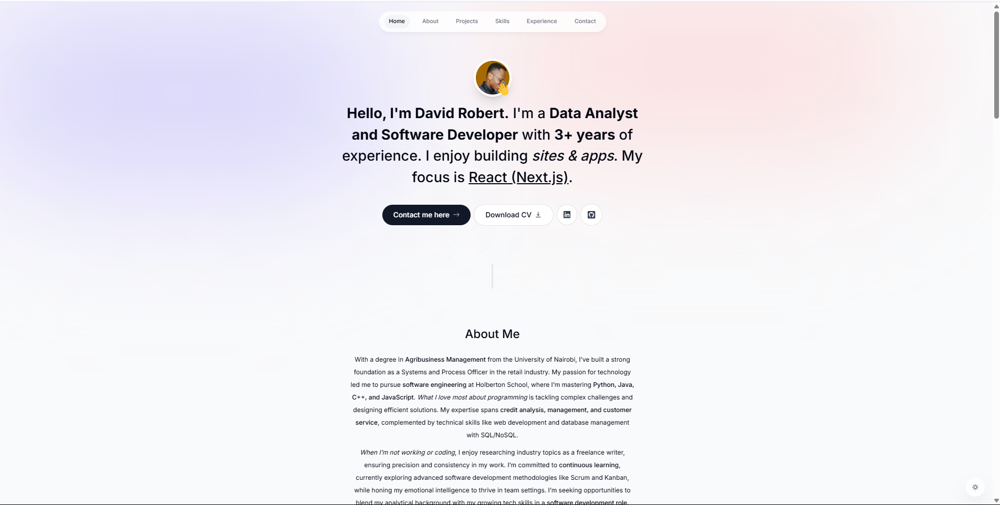

# 👋 Hello, I'm David Robert!

I'm a **Sales Analyst and Software Engineering Student** based in Nairobi County, Kenya, with over **5 years of professional experience**. I specialize in building data-driven solutions and applications, with a focus on **Python** and **JavaScript**. I enjoy combining my analytical background with my growing technical skills to create impactful projects.

This repository serves as my GitHub profile and hosts my personal portfolio website, where you can explore my work, skills, and journey.

---

## 🌟 About Me

- 🎓 **Education**: B.Sc. in Agribusiness Management from the University of Nairobi (2015-2019), currently pursuing Software Engineering at Holberton School (2023-2024).
- 💼 **Experience**: Experienced Systems and Process Officer in the retail industry, now transitioning into software development.
- 🛠️ **Skills**: Skilled in Management, Customer Service, Emotional Intelligence, and Analytical Skills, with technical expertise in Python, JavaScript, HTML, CSS, SQL/NoSQL, and Git.
- 🏆 **Certifications**: Innovative Customer Service Techniques, Developing Your Emotional Intelligence, Managing Teams, and more.
- 🌱 **Currently Learning**: Advanced software development methodologies (Scrum, Kanban) and modern programming practices.

---

## 🚀 My Portfolio Website

This repository contains my personal portfolio website, built with **Next.js**, **React**, and **Tailwind CSS**. It showcases my professional journey, skills, and projects as I transition into software engineering.

### Features
- 📱 **Responsive Design**: Works seamlessly on all devices.
- 🎨 **Modern UI**: Clean and professional design with light/dark mode support.
- 📧 **Contact Form**: Integrated with React.Email and Resend for easy communication.
- ✨ **Animations**: Smooth transitions using Framer Motion.

### Live Demo
Check out the live site: [david-robert-portfolio.vercel.app](https://david-robert-portfolio.vercel.app) *(Update this link after deployment)*

### Screenshots
 *(Add a screenshot of your portfolio site)*

---

## 🛠️ Skills

### Professional Skills
- Credit Analysis
- Accounting
- Credit Appraisals
- Management
- Customer Service
- Emotional Intelligence
- Analytical Skills

### Technical Skills
- **Languages**: Python, Java, C++, JavaScript
- **Web Development**: HTML, CSS
- **Databases**: SQL, NoSQL
- **Tools**: Git

---

## 💼 Experience Highlights

- **Sales Analyst at Kenafric Industries Ltd** (Nov 2024 - Present)  
  - Compile, analyze, and report sales data to provide actionable insights.  
  - Forecast demand, revenue, and expenses to guide sales strategies.

- **Software Engineering Student at alx_africa** (Aug 2023 - Present)  
  - Mastering Python, Java, C++, and JavaScript.  
  - Learning data structures, algorithms, and web development.

- **Credit Analyst at Bboxx** (Jan 2024 - Nov 2024)  
  - Analyzed customer repayment patterns to assess credit quality.  
  - Prepared portfolio performance reports to support business decisions.

*See my full experience on the portfolio site!*

---

## 📫 Get in Touch

- 📧 **Email**: [nyamwangedavid2019@gmail.com](mailto:nyamwangedavid2019@gmail.com)
- 🔗 **LinkedIn**: [linkedin.com/in/david-robertny](https://www.linkedin.com/in/david-robertny)
- 📱 **Phone**: 0708999688
- 💻 **GitHub**: [github.com/devdavidrobert](https://github.com/devdavidrobert)

---

## 🏆 Fun Fact
I’ve been recognized with a **Customer Service Award** for my dedication to excellence in the retail industry!

---

*Built with ❤️ using Next.js, React, and Tailwind CSS.*