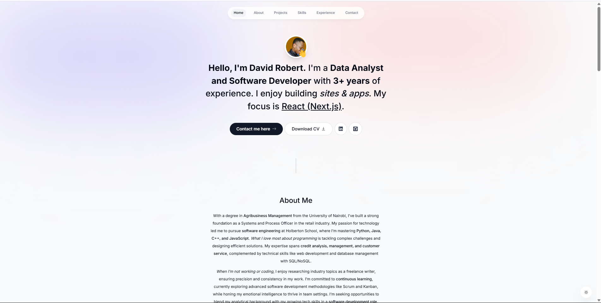

Hi there 👋

# [Watch video here](https://youtu.be/sUKptmUVIBM)

## What you will learn

- Latest Next.js 13 features
- Next.js App Router
- Next.js Server Actions
- Client & Server Components
- TypeScript (Beginner & Intermediate)
- Tailwind CSS
- Context API
- Advanced Animations with Framer Motion
- React.Email & Resend
- Custom React hooks
- Fresh, modern UI design
- Light & Dark mode
- Responsive website

## Important

If you want to be a professional developer, you have to know the fundamentals like JavaScript and CSS really well. I highly recommend you go through my [Professional JavaScript](https://bytegrad.com/courses/professional-javascript) and [Professional CSS](https://bytegrad.com/courses/professional-css) courses.

I'm close to releasing a complete React & Next.js course. Get on the email list to receive early-bird pricing: [link](https://email.bytegrad.com/).

## Setup

1. Add RESEND_API_KEY environment variable in .env.local
2. In the send-email.ts action file, change the "to" email to your own email
This repository contains my personal portfolio website, built with **Next.js**, **React**, and **Tailwind CSS**. It showcases my professional journey, skills, and projects as I transition into software engineering.

### Features
- 📱 **Responsive Design**: Works seamlessly on all devices.
- 🎨 **Modern UI**: Clean and professional design with light/dark mode support.
- 📧 **Contact Form**: Integrated with React.Email and Resend for easy communication.
- ✨ **Animations**: Smooth transitions using Framer Motion.

### Live Demo
Check out the live site: [david-robert-portfolio.vercel.app](https://david-robert-portfolio.vercel.app) *(Update this link after deployment)*

### Screenshots
 *(Add a screenshot of your portfolio site)*

---

## 🛠️ Skills

### Professional Skills
- Credit Analysis
- Accounting
- Credit Appraisals
- Management
- Customer Service
- Emotional Intelligence
- Analytical Skills

### Technical Skills
- **Languages**: Python, Java, C++, JavaScript
- **Web Development**: HTML, CSS
- **Databases**: SQL, NoSQL
- **Tools**: Git

---

## 💼 Experience Highlights

- **Sales Analyst at Kenafric Industries Ltd** (Nov 2024 - Present)  
  - Compile, analyze, and report sales data to provide actionable insights.  
  - Forecast demand, revenue, and expenses to guide sales strategies.

- **Software Engineering Student at alx_africa** (Aug 2023 - Present)  
  - Mastering Python, Java, C++, and JavaScript.  
  - Learning data structures, algorithms, and web development.

- **Credit Analyst at Bboxx** (Jan 2024 - Nov 2024)  
  - Analyzed customer repayment patterns to assess credit quality.  
  - Prepared portfolio performance reports to support business decisions.

*See my full experience on the portfolio site!*

---

## 📫 Get in Touch

- 📧 **Email**: [nyamwangedavid2019@gmail.com](mailto:nyamwangedavid2019@gmail.com)
- 🔗 **LinkedIn**: [linkedin.com/in/david-robertny](https://www.linkedin.com/in/david-robertny)
- 📱 **Phone**: 0708999688
- 💻 **GitHub**: [github.com/devdavidrobert](https://github.com/devdavidrobert)

---

## 🏆 Fun Fact
I’ve been recognized with a **Customer Service Award** for my dedication to excellence in the retail industry!

---

*Built with ❤️ using Next.js, React, and Tailwind CSS.*
